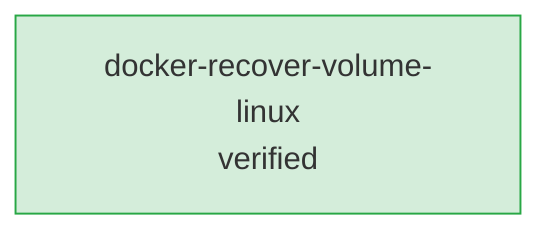

# Notes Index

全ノートのカタログ（raw層）。個別の事実・手順を探すときに参照する。

テーマ単位で体系化した正本は [wiki/](../wiki/README.md) にある。**「次の案件でこれをやりたい」から引く場合は wiki を先に見る。** このindexは、wikiに統合されていない個別ノートを探すためのもの。

## カテゴリ

ノートが増えてきたら `area` タグごとにセクションを分ける。最初は1つのテーブルで足りる。

### infra
| ファイル | 概要 | status | updated |
|------|------|------|------|
| [20260513-docker-recover-volume-linux.md](20260513-docker-recover-volume-linux.md) | **サンプル**：LinuxでDockerボリュームの権限不一致を復旧する手順 | verified | 2026-05-13 |

> サンプルノートは書き方の見本です。自分のノートを1件書いたら削除してかまいません。

## ノート関係グラフ

ノートが10件を超えたら、参照関係を図にしておくと孤立ノートが見つけやすくなる。
図はAIエージェントに更新させる（`このグラフを最新のノート構成に更新して`）。

凡例: 緑=verified / 黄=draft。Lintや参照追加のたびにこのグラフを更新する。

## Lint チェック項目（定期実施）
- 矛盾するノートがないか
- 90日以上更新されていないノートがないか
- 孤立ノート（他ノートから参照されていない）がないか
- verified昇格待ちのdraftが滞留していないか
- **このindexに載っていないノートがないか**（`ls notes/*.md` と突き合わせる）
- **wikiに未統合のノートが溜まっていないか**（`wiki/README.md` のテーマ一覧と突き合わせる）

AIエージェントに「Lintして」と頼むと、`.github/prompts/lint.prompt.md` の手順で点検してくれる。
